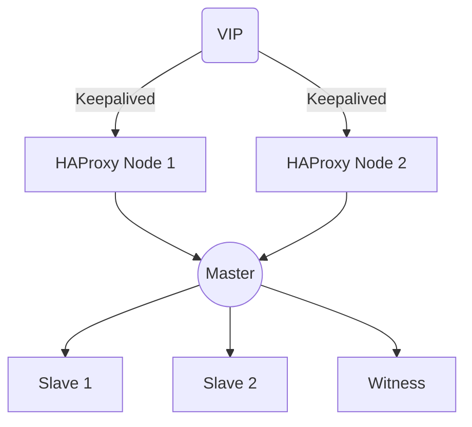

# DockyCluster

A production-ready container cluster deployment solution with built-in support for MinIO, Nginx, Redis, Nacos, PostgreSQL, and more.


## Structure

```
DockyCluster/
├── minio-cluster/           # MinIO deployment
├── nginx-cluster/           # Nginx deployment
├── redis-cluster/           # Redis deployment
├── nacos-cluster/           # Nacos deployment
├── postgresql-cluster/      # PostgreSQL deployment
├── lb1                      # Load balancer 1
├── lb2                      # Load balancer 2
├── .env.example            # Environment template
└── README.md               # Documentation
```

## Quick Start

```bash
git clone https://github.com/FreemanKevin/DockyCluster.git
cd DockyCluster

cd XXX-cluster/
cp .env.example .env
docker-compose up -d
```

#### High Availability

Supports VIP + Keepalived + HAProxy for transparent failover:



##### Load Balancer Setup

1. Install requirements:
```bash
sudo apt-get update
sudo apt-get install keepalived haproxy
```

2. Configure LB:
```bash
cd lb
# Update IPs and ports in configs
cp haproxy.cfg /etc/haproxy/
cp keepalived.conf /etc/keepalived/
systemctl enable --now haproxy keepalived
```
