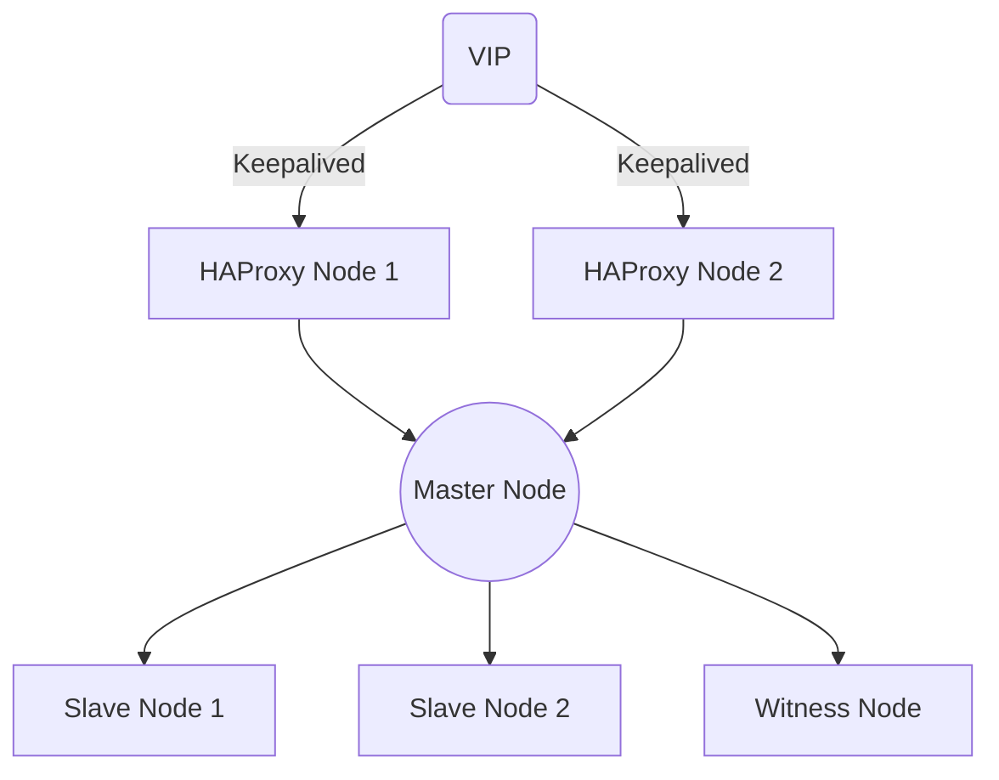

## DockyCluster

**DockyCluster** 是一个开箱即用的多服务容器化集群部署项目，旨在为开发者和运维人员提供快速搭建和管理多种服务的能力。项目支持 `MinIO`、`Nginx`、`Redis`、`Nacos`、`PostgreSQL` 等常用服务，包含示例配置和高可用方案。


### 特性

- 支持多种常见服务的容器化部署
- 提供示例 `.env` 配置文件，方便自定义参数
- 高可用架构示例（如 PostgreSQL 的 HA 配置）
- 便捷的 SSL 证书生成和挂载方法
- 支持静态资源分发、持久化存储和数据备份

------

### 目录结构

```plaintext
DockyCluster/
├── minio-cluster/           # MinIO 集群部署
├── nginx-cluster/           # Nginx 集群部署
├── redis-cluster/           # Redis 集群部署
├── nacos-cluster/           # Nacos 集群部署
├── postgresql-cluster/      # PostgreSQL 集群部署
├── lb1                      # 示例配置文件
├── lb2                      # 示例配置文件
├── .env.example             # 示例环境变量文件
└── README.md                # 项目说明文档
```

------

### 快速开始

#### 1. 克隆项目

```bash
git clone https://github.com/FreemanKevin/DockyCluster.git
cd DockyCluster
```

#### 2. 配置环境变量

在每个服务目录下提供了 `.env.example` 示例文件，请根据需要复制并修改：

```bash
cp .env.example .env
vim .env # 根据实际需求修改配置
```

#### 3. 启动服务

进入对应服务的目录，运行以下命令启动服务：

```bash
docker-compose up -d
```

服务成功启动后可通过日志查看运行状态：

```bash
docker-compose logs -f
```

------

### 服务部署指南

#### 1. MinIO 集群

- **路径**：`minio-cluster/`

- **功能**：分布式对象存储

- **启动方式**：

  ```bash
  cp .env.example .env
  vim .env
  docker-compose up -d
  ```

#### 2. Nginx 集群

- **路径**：`nginx-cluster/`

- **功能**：反向代理与静态资源分发

- **启动方式**：

  ```bash
  cp .env.example .env
  vim .env
  docker-compose up -d
  ```

- **生成自签名证书**：

  ```bash
  openssl req -x509 -nodes -days 3650 -newkey rsa:2048 \
    -keyout localserver.com.key -out localserver.com.crt \
    -subj "/C=US/ST=State/L=City/O=Organization/CN=localserver.com"
  ```

#### 3. Redis 集群

- **路径**：`redis-cluster/`

- **功能**：高性能分布式缓存

- **启动方式**：

  ```bash
  cp .env.example .env
  vim .env
  docker-compose up -d
  ```

#### 4. Nacos 集群

- **路径**：`nacos-cluster/`

- **功能**：服务注册与配置管理

- **启动方式**：

  ```bash
  cp .env.example .env
  vim .env
  docker-compose up -d
  ```

#### 5. PostgreSQL 集群

- **路径**：`postgresql-cluster/`
- **功能**：高可用关系型数据库
- **启动方式**：

  ```bash
  mkdir -p /data/postgres/{master,standby1,standby2,witness}
  chown -R 1001:1001 /data/postgres/
  chmod -R 700 /data/postgres/

  cp .env.example .env
  vim .env
  docker-compose up -d
  ```

- **数据备份**：
  ```bash
  ./pg_basebackup.sh
  ls /data/postgresql_backup/
  ```

##### 5.1 高可用架构

支持 `VIP + Keepalived + HAProxy`，屏蔽主从切换对应用的影响。

###### 5.1.1 架构图



###### 5.1.2 LB 节点配置

准备两个新的 LB 节点，并安装所需组件：

```bash
# 安装 Keepalived 和 HAProxy
sudo apt-get update
sudo apt-get install keepalived haproxy
```

**LB1 配置：**

```bash
# 上传配置文件到 LB1
cd lb1
vim haproxy.cfg     # 更新 PG 数据库集群的 IP 和端口
vim keepalived.conf # 更新物理 IP、VIP 和网卡名称

\cp -rvf haproxy.cfg     /etc/haproxy/haproxy.cfg
\cp -rvf keepalived.conf /etc/keepalived/keepalived.conf

haproxy -c -f /etc/haproxy/haproxy.cfg
systemctl start haproxy.service
systemctl enable haproxy.service
systemctl status haproxy.service -l --no-pager

systemctl start keepalived.service
systemctl enable keepalived.service
systemctl status keepalived.service -l --no-pager
```

**LB2 配置：**

```bash
# 上传配置文件到 LB2
cd lb2
vim haproxy.cfg     # 更新 PG 数据库集群的 IP 和端口
vim keepalived.conf # 更新物理 IP、VIP 和网卡名称

\cp -rvf haproxy.cfg     /etc/haproxy/haproxy.cfg
\cp -rvf keepalived.conf /etc/keepalived/keepalived.conf

haproxy -c -f /etc/haproxy/haproxy.cfg
systemctl start haproxy.service
systemctl enable haproxy.service
systemctl status haproxy.service -l --no-pager

systemctl start keepalived.service
systemctl enable keepalived.service
systemctl status keepalived.service -l --no-pager
```

------

### 常见问题

1. **服务无法启动？**
   - 检查 `.env` 文件中的配置是否正确。
   - 确保 Docker 和 Docker Compose 版本满足最低要求。
2. **镜像下载失败？**
   - 网络问题可能导致拉取镜像失败，可尝试更换国内镜像源。
3. **需要额外支持？**
   - 提交 Issue 或在项目主页提问：[DockyCluster Issues](https://github.com/FreemanKevin/DockyCluster/issues)

------

### 贡献

欢迎贡献代码、修复 Bug 或提交功能建议：

1. Fork 项目
2. 创建分支：`git checkout -b feature/your-feature`
3. 提交更改：`git commit -m "Add your feature"`
4. 推送分支：`git push origin feature/your-feature`
5. 创建 Pull Request

------

### 授权

本项目基于 [MIT License](LICENSE) 开源。